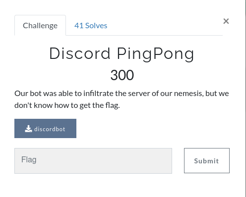
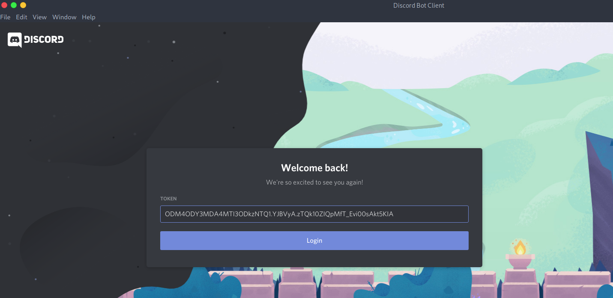
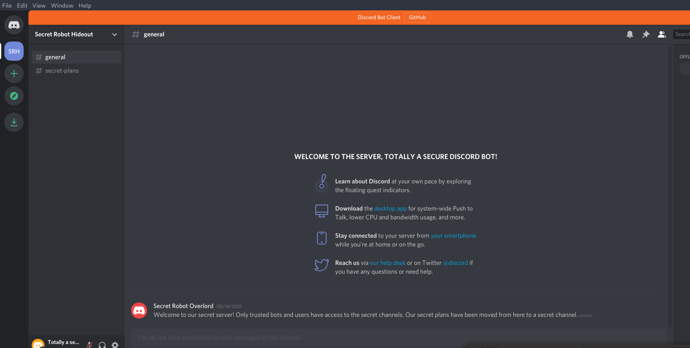

## Discord PingPong

**Category: web**



Discord PingPong challenge was a great challenge and i loved it very much. Here is how i managed to solve it.

In this challenge you are provided with a binary `discordbot`. Which implements an actual discord bot.
When you run it you get:
```
joe@system:~/Desktop$ ./discordbot 

Successfully connected to Discord API
Last message in #general is: Welcome to our secret server! Only trusted bots and users have access to the secret channels. Our secret plans have been moved from here to a secret channel.
Bot is now running.  Press CTRL-C to exit.
```

So we have been given the actual bot's binary! What can we find in that binary? Usernames? Passwords? Tokens? 
Debugging time!

```
joe@system:~/Desktop$ gdb ./discordbot
...
gef➤  r
Starting program: /home/john/Desktop/DCTF/discordbot 
[New LWP 9181]
[New LWP 9182]
[New LWP 9183]
Successfully connected to Discord API
[New LWP 9184]
Last message in #general is: Welcome to our secret server! Only trusted bots and users have access to the secret channels. Our secret plans have been moved from here to a secret channel.
Bot is now running.  Press CTRL-C to exit.
[New LWP 9185]
[New LWP 9186]

Ctrl+Z <= pause the program
...
```
The first thing i searched was for usernames and tokens using the `grep` command in gdb gef.

```
gef➤  grep "username"
[+] Searching 'username' in memory
[+] In '/home/john/Desktop/DCTF/discordbot'(0x6bf000-0x91c000), permission=r--
  0x6c3829 - 0x6c3831  →   "username" 
  0x6d35ef - 0x6d35f7  →   "username[...]" 
  0x75da5d - 0x75da94  →   "username/passwordjson: Unexpected key typejson: un[...]" 
  0x75e4c9 - 0x75e500  →   "username/password%s Failed (%s), Retrying...363797[...]" 
  0x7614f9 - 0x761530  →   "username/password versionleafCounts[maxBits][maxBi[...]" 
  0x763f6b - 0x763fa2  →   "username/password authentication failedx509: faile[...]" 
[+] In (0xc000000000-0xc000600000), permission=rw-
  0xc00006b651 - 0xc00006b688  →   "username":"Totally a secure Discord bot","mfa_enab[...]" ; Interesting???
  0xc0003359c0 - 0xc0003359c8  →   "username[...]" 
  0xc0003359d1 - 0xc0003359db  →   "username":" 
  0xc0003359e1 - 0xc0003359eb  →   "username":"

gef➤  x/s 0xc00006b651
0xc00006b651:	"username\":\"Totally a secure Discord bot\",\"mfa_enabled\":false,\"id\":\"838867008127893545\",\"flags\":0,\"email\":null,\"discriminator\":\"8463\",\"bot\":true,\"avatar\":null},\"session_id\":\"07b7a5f1fa591540510acc0576469708\",\"relationships\":[],\"private_channels\":[],\"presences\":[],\"guilds\":[{\"unavailable\":true,\"id\":\"838867536220127303\"}],\"guild_join_requests\":[],\"geo_ordered_rtc_regions\":[\"europe\",\"russia\",\"india\",\"southafrica\",\"us-east\"],\"applic"
```

`username:"Totally a secure Discord bot"`
`id:"838867008127893545"`

As we can see above we found the bot's username and his client id. But unfortuantly we can't invite the bot to our own server because is registered as non-public bot. So we have to find another way to interact with it.

The next thing i searched was for tokens, if we manage to steal his token we can log in as we were the bot!

```
gef➤  grep "token"
[+] Searching 'token' in memory
[+] In '/home/john/Desktop/DCTF/discordbot'(0x6bf000-0x91c000), permission=r--
  0x6c0eeb - 0x6c0ef0  →   "token" 
  0x6c19d8 - 0x6c19de  →   "tokens" 
  0x6c5df4 - 0x6c5dfe  →   "tokenError" 
  0x6c5e01 - 0x6c5e0b  →   "tokenStack" 
  0x6c5e0e - 0x6c5e18  →   "tokenState" 
  0x6c732c - 0x6c7331  →   "token[...]" 
  0x6c95d3 - 0x6c95e0  →   "tokenValueEnd" 
  0x6c9799 - 0x6c979e  →   "token" 
  0x6cd72f - 0x6cd740  →   "tokenValueAllowed" 
  0x6cf246 - 0x6cf24b  →   "token[...]" 
  0x6d0eab - 0x6d0ec0  →   "tokenPrepareForDecode" 
  0x6eaf08 - 0x6eaf28  →   "token""; MFA bool "json:"mfa"" }" 
  0x704da5 - 0x704dd5  →   "token""; SessionID string "json:"session_id""; S" 
  0x7583b2 - 0x7583e9  →   "tokenfloat32nan2float64nan1float64nan2float64nan3g[...]" 
  0x75f45f - 0x75f496  →   "token too longcrypto/aes: invalid key size crypto/[...]" 
  0x760ce5 - 0x760d1c  →   "token after slashnon-Go code disabled sigaltstackn[...]" 
  0x76384e - 0x763885  →   "tokennet/http: invalid header field name %qruntime[...]" 
  0x766929 - 0x766960  →   "token. %vbufio: writer returned negative count fro[...]" 
  0x767c35 - 0x767c6c  →   "tokens without progressingchacha20: internal error[...]" 
  0x76b183 - 0x76b1ba  →   "token was not a bot token. Please add "Bot " to th[...]" 
  0x76b197 - 0x76b1ce  →   "token. Please add "Bot " to the start of your toke[...]" 
  0x76b1c5 - 0x76b1fc  →   "token. https://discord.com/developers/docs/referen[...]" 
  0x76b215 - 0x76b21a  →   "token[...]" 
  0x7e5d93 - 0x7e5d9f  →   "token.length" 
  0x7e5dc9 - 0x7e5dd5  →   "token.offset" 
  0x7e85f8 - 0x7e8602  →   "tokenEqual" 
  0x7f0ef7 - 0x7f0f08  →   "tokenValueAllowed" 
  0x7f0f22 - 0x7f0f2f  →   "tokenValueEnd" 
  0x7f1037 - 0x7f104c  →   "tokenPrepareForDecode" 
  0x7f8aab - 0x7f8adb  →   "token""; SessionID string "json:"session_id""; S" 
  0x7fb123 - 0x7fb143  →   "token""; MFA bool "json:"mfa"" }" 
  0x803a7e - 0x803a86  →   "token.go" 
[+] In (0xc000000000-0xc000600000), permission=rw-
  0xc00001ac4e - 0xc00001ac56  →   "token":"" 
  0xc000070e4e - 0xc000070e85  →   "token":"Bot ODM4ODY3MDA4MTI3ODkzNTQ1.YJBVyA.zTQk10[...]"  <== Bingo!!!
  0xc0002ccb38 - 0xc0002ccb3d  →   "token" 
  0xc0002ccb41 - 0xc0002ccb46  →   "token[...]" 
  0xc0002ccb49 - 0xc0002ccb4e  →   "token[...]" 
  0xc000335aa8 - 0xc000335aad  →   "token" 
  0xc000335ab1 - 0xc000335ab6  →   "token[...]" 
  0xc000335ab9 - 0xc000335abe  →   "token[...]" 

gef➤  x/s 0xc000070e4e
0xc000070e4e:	"token\":\"Bot ODM4ODY3MDA4MTI3ODkzNTQ1.YJBVyA.zTQk10ZIQpMfT_Evi00sAkt5KIA\",\"properties\":{\"$os\":\"linux\",\"$browser\":\"DiscordGo v0.23.0\",\"$device\":\"\",\"$referer\":\"\","
  ```
  `"token":"Bot ODM4ODY3MDA4MTI3ODkzNTQ1.YJBVyA.zTQk10ZIQpMfT_Evi00sAkt5KIA"`
  Bingo!! we found the bot token!
  
  With that token you can impersonate the bot. This token is equivalent to a login cookie but for discord. You can interact with the discord api as the creator's bot. There is a patched version of discord which makes the login process more much more easy.
  https://github.com/Flam3rboy/discord-bot-client
  
  Downloading `discord-bot-client` and sign in with the above bot token:
  
  
  
  

  
  
  
